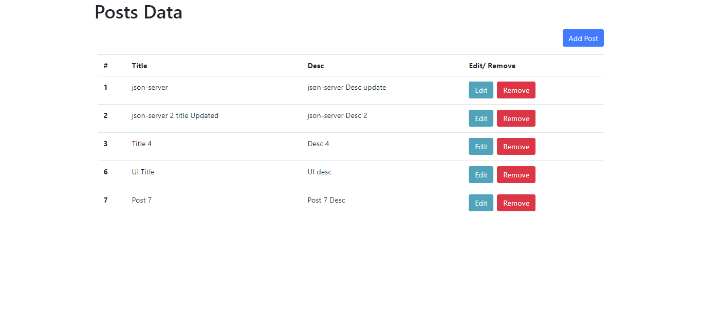
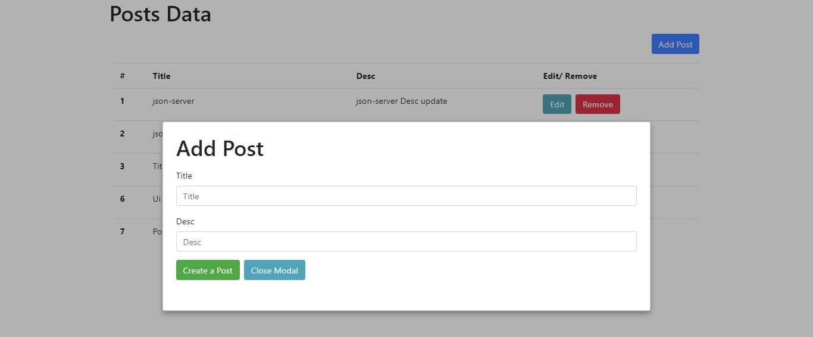
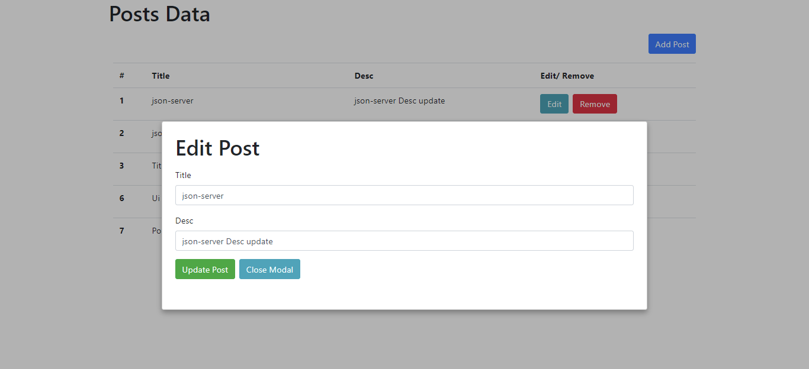

# react-sample-demo

### `yarn start` -  to run UI

Runs the app in the development mode.\
Open [http://localhost:3000](http://localhost:3000) to view it in the browser.

The page will reload if you make edits.\
You will also see any lint errors in the console.

### `json-server --watch db.jso -p 5000` - to run Backend

Before running this command install "json-server" npm package globally.
db.json is will workin as API.

### Images

Basic

Create Post

Edit Post

